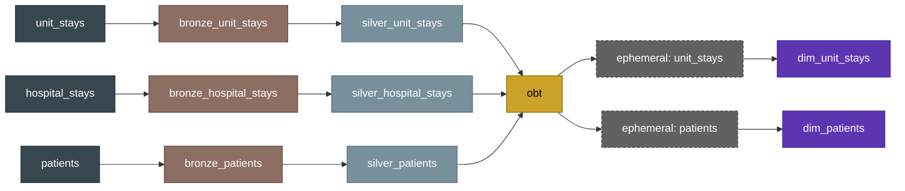

# Medical DBT: Hospital ICU Data Transformation Pipeline

A dbt project that transforms raw hospital ICU admission data (patients, hospital
stays, and unit stays) into a clean, tested, analytics-ready dataset on Snowflake,
using a bronze → silver → gold layered architecture with full SCD Type 2 history
tracking via snapshots.

## Tech stack

| Layer | Tool |
|---|---|
| Data warehouse | Snowflake |
| Transformation | dbt-core 1.12.x |
| Adapter | dbt-snowflake |
| Packages | [dbt_utils](https://github.com/dbt-labs/dbt-utils), [codegen](https://github.com/dbt-labs/dbt-codegen) |
| Orchestration (local dev) | dbt CLI |
| Source control | Git / GitHub |

## Architecture

Raw data lands in a `staging` schema (loaded by an external process, outside dbt's
control) and flows through three dbt-managed layers:

```
staging (raw)
   │
   ▼
bronze   — incremental, append-only capture of raw source data
   │
   ▼
silver   — incremental, deduplicated to one row per business key (latest wins)
   │
   ▼
gold     — one-big-table (obt) joining all three entities for consumption
```

In parallel, **snapshots** capture full SCD Type 2 history (every version of a row,
not just the latest) for entities where historical state matters, independent of
what silver keeps as "current."

### Lineage



- **Sources**: `staging.patients`, `staging.hospital_stays`, `staging.unit_stays`
  (Snowflake database: `hospital`)
- **Bronze**: incremental, append-only. Filters on `create_date > max(create_date)`
  already loaded — captures every version of a record as raw source data changes
  over time, with no deduplication.
- **Silver**: incremental with a `unique_key` per entity (`uniquepid`,
  `patienthealthsystemstayid`, `patientunitstayid`). Deduplicates bronze's raw,
  versioned rows down to the latest version per business key via
  `qualify row_number() ... order by create_date desc = 1`.
- **Gold (`obt`)**: a single wide table joining unit stays, hospital stays, and
  patient attributes — built for direct consumption by BI/reporting.
- **Snapshots** (`dim_patients`, `dim_unit_stays`): SCD Type 2 history tables,
  built off ephemeral pass-through models that reshape `obt`'s output before
  snapshotting. These preserve every historical version of a row
  (`dbt_valid_from` / `dbt_valid_to`), which bronze (raw duplicates) and silver
  (current-state-only) do not.

## Data model

**patients** — demographics: `uniquepid`, `gender`, `age`, `age_category`,
`is_age_90_plus`, `ethnicity`.

**hospital_stays** — one row per hospital admission: `patienthealthsystemstayid`,
`hospitalid`, `hospitaldischargelocation`, `hospitaldischargestatus`.

**unit_stays** — one row per ICU unit stay: `patientunitstayid`, `wardid`,
`unittype`, `apacheadmissiondx`, admission/discharge height & weight, admit/discharge
times, discharge location & status.

**obt** — the gold consumption table, joining all three at the unit-stay grain,
with a computed `weight_difference` column (admission weight − discharge weight).

## Custom macros

| Macro | Purpose |
|---|---|
| `age_category(age)` | Buckets a numeric age into `teenager` / `young adult` / `adult` / `senior` |
| `weight_loss(x, y)` | Rounds `x - y` — used to compute weight change across a stay |
| `multiply(x, y)` | Rounds `x * y` to 2 decimal places |
| `generate_schema_name(...)` | Overrides dbt's default schema-naming behavior so models build into their configured schema (e.g. `bronze`, `silver`, `gold`) rather than being prefixed with the target schema |

## Testing

Data quality is enforced with a mix of:
- **Generic tests** (`unique`, `not_null`, `relationships`) on primary and foreign
  keys across the bronze/silver/gold layers.
- **Singular tests** for business-rule checks — e.g. flagging patients with
  `age > 80` for manual review (`severity: warn`, so it surfaces without failing
  the build).

## Project structure

```
sf_dbt_medical/
├── dbt_project.yml        # project-level config: paths, per-layer materializations/schemas
├── profiles.yml           # Snowflake connection config (not committed to git)
├── packages.yml           # dbt_utils, codegen
├── models/
│   ├── sources/           # source declarations (staging.*)
│   ├── bronze/            # incremental, append-only raw capture
│   ├── silver/            # incremental, deduplicated current-state
│   └── gold/
│       ├── obt.sql         # one-big-table consumption model
│       └── ephemeral/      # pass-through models feeding the snapshots
├── snapshots/              # SCD Type 2 history (dim_patients, dim_unit_stays)
├── macros/                 # custom Jinja macros
├── seeds/                  # static reference data (CSV)
├── tests/                  # singular data tests
└── analyses/                # ad hoc exploratory SQL (not materialized)
```

## Running the project

```bash
dbt deps                                          # install packages
dbt run --select bronze_unit_stays silver_unit_stays   # build a slice incrementally
dbt build                                         # build + test everything
dbt snapshot                                      # capture SCD2 history
dbt docs generate && dbt docs serve                # browse full lineage & docs
```

Credentials are supplied via `profiles.yml`, targeting a `dev` Snowflake
environment by default.
